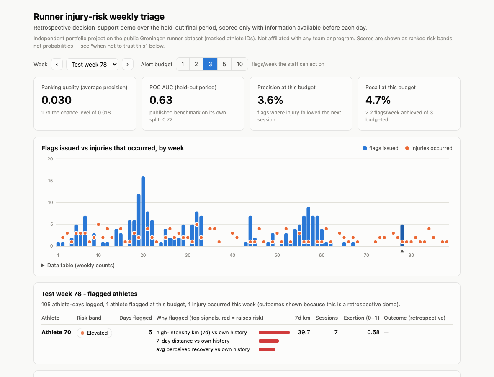
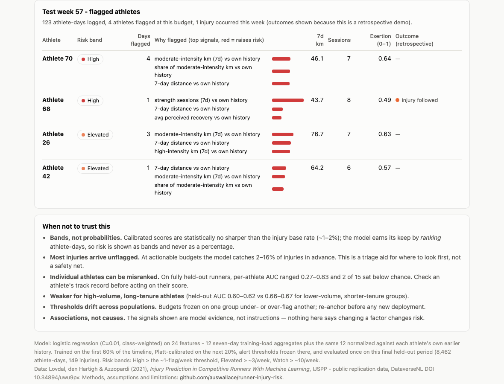

# Runner Injury Risk Model

Predicting injury risk in competitive runners from day-by-day training load, on the
University of Groningen open dataset (74 elite Dutch runners, 7 years of training logs,
injury event labels).

**Why this project:** injury-risk surveillance is a rare-event prediction problem with
real operational stakes: messy longitudinal data, heavy class imbalance, and a score
that has to be trustworthy enough to drive preventive decisions about people. This
repo builds that loop end to end: features from training load, a calibrated classifier,
honest evaluation against a published benchmark, and a decision-support view of the
output.

*Independent project on public data. Not affiliated with any military program,
government agency, or employer.*

## Data

Lovdal, S., den Hartigh, R., & Azzopardi, G. (2021). Injury Prediction in Competitive
Runners With Machine Learning. *International Journal of Sports Physiology and
Performance*, 16(10), 1522-1531. Replication data: DOI
[10.34894/uwu9pv](https://doi.org/10.34894/uwu9pv) (DataverseNL, open access).

Run `python data/fetch_data.py` to download the data into `data/raw/` (not committed
to git). See `data/README.md` for provenance and citation details.

## Structure

```
data/            fetch script + provenance notes (raw data gitignored)
notebooks/       01 EDA -> 02 features -> 03 model -> 04 evaluation
dashboard/       decision-support view builder (generated HTML gitignored)
docs/            evaluation design, assumptions & limitations, session log
```

## Method

- Features: 12 seven-day training-load aggregates (distance, intensity mix, rest,
  strength work, perceived exertion/recovery), each in raw form and normalized
  against the athlete's own strictly earlier healthy history. The originally planned
  chronic-load/ACWR features died on a dataset artifact - see Status below
- Models: regularized logistic regression baseline, then XGBoost (the source paper
  used bagged XGBoost - its reported AUC is the benchmark). Logistic won
- Evaluation: time-aware splits (train early years, test later) and athlete-grouped
  splits to prevent leakage; precision-recall alongside ROC (rare events make ROC
  flattering); Platt-calibrated probabilities with Brier scores; alert-budget table;
  subgroup checks. Pre-registered in `docs/evaluation_design.md` before modeling
- Output: weekly flagged-athletes view with top contributing signals per flag and an
  explicit "when not to trust this" panel

## Status

- 01_eda done: 1.36% positive rate (583/42,766 rows), Date confirmed as a shared
  calendar index, missingness resolved (zero-km days are logged rest; true gaps live
  between rows), window ordering proven structurally (2.5M zero-mismatch checks)
- 02_features + 03_model done, and the two corrections along the way are the most
  interesting part of the project:
  1. **A first feature set with 28-day chronic load / ACWR hit validation AUC 0.987
     and was killed as a leak.** Those features were NaN for 100% of injury rows
     versus 4-19% of healthy rows, and a single missing-indicator flag carried 93%
     of XGBoost's gain. Cause: the data's publishers required healthy events to be
     injury-free for 3 weeks either side, so any window reaching past a row's own 7
     days is empty for injury rows only and its missingness encodes the label.
     Confirmed afterwards in the paper's own Methods. Chronic load and ACWR are
     therefore unbuildable on this dataset - documented rather than shipped.
  2. **Reading the source paper corrected a window assumption of mine.** All 7 slots
     are pre-event days (the target is whether the *next* session brings injury), so
     the newest slot is the day before the injury, not the injury day. An
     over-cautious 6-day window was costing real signal
- Leak-free results, closing on the published benchmark: per-athlete normalization
  (adopted from the paper, recomputed to use only each athlete's earlier healthy
  rows so no row sees its own future) roughly doubles average precision. Best model
  is regularized logistic regression - it beat XGBoost on every comparison
- Athlete-grouped CV: **AUC 0.690, AP 0.064 vs 0.014 chance (4.5x)**, against the
  paper's 0.724 on their closest-analogue split (their test set is the 10 newest
  athletes). Time-aware: AUC 0.634, AP 0.032 vs 0.016 chance
- The paper reports ROC only. At this dataset's 1.4% prevalence its published
  operating point (58.4% sensitivity, 74.1% specificity) implies roughly 3%
  precision - about 32 false alarms per true flag. Making that visible, via
  precision-recall, calibration and an alert-budget view, is what 04 adds
- 04_evaluation done - the locked test sets were touched exactly once, with every
  decision (calibration method, thresholds, subgroup cutoffs) locked beforehand:
  - **Test AP 0.030 on both splits** (1.7x chance time-aware, 2.6x athlete-grouped);
    AUC 0.629 / 0.619 against the paper's 0.724
  - The grouped CV-to-test AUC drop (0.690 to 0.619) is athlete heterogeneity, not
    a bug: per-athlete AUC spans 0.27-0.83 and 2 of 15 evaluable held-out athletes
    sit below 0.5. The average hides athletes the model actively misranks
  - Platt calibration repairs the gross miscalibration of class-weighted training
    (Brier 0.245 to 0.017) but lands statistically tied with predicting the base
    rate. The score is a useful ranking, not a sharp probability - so the dashboard
    shows risk bands, never percentages
  - Alert budget: 2.9-4.3% precision at 1-5 flags/week, recall 2-18%. The paper's
    implied ~3% precision, made explicit instead of left implied
  - Two days of warning costs almost nothing (6-slot window: grouped AP 0.032 vs
    0.030) - the operationally friendlier lead time is essentially free
- Decision-support dashboard done (see below)
- Findings and every assumption logged in `docs/assumptions_limitations.md`,
  including the filled-in "when NOT to trust the score" section

## Decision-support view

A self-contained HTML dashboard (no dependencies, no server) that replays the
held-out final period week by week as the triage tool staff would have seen: an
alert-budget selector, flagged athletes with the top signals behind each flag, risk
bands instead of probabilities, and the model's blind spots stated on the page.





The generated file embeds athlete-day level rows, so it is not committed (see
`data/README.md`); rebuild it locally with:

```
python3 dashboard/build_dashboard.py
```

The builder refits the exact evaluated model and asserts it reproduces 04's saved
test metrics before writing anything.
